# ds-project

## Requirements

- pyenv
- python==3.11.3

# Data

King_County_House_prices_dataset

# Goals

## Hypothesis

### Client

| Timothy Stevens | Seller | Owns expensive houses in the center, needs to get rid, best timing within a year, open for renovation when profits rise |
| --------------- | ------ | ----------------------------------------------------------------------------------------------------------------------- |

### Question and Hypothesis

| Questions                                                                                                          | Hytothesis                                                                                                                   |
| ------------------------------------------------------------------------------------------------------------------ | ---------------------------------------------------------------------------------------------------------------------------- |
| When is the best time within the year to sell expensive houses in the city center for the highest possible profit? | 1 - House prices in the city center peak during the spring and summer months due to increased demand.\*                      |
|                                                                                                                    | 2- During holiday seasons (like Thanksgiving or Christmas) Houses sell for lower prices because of reduced buyer activity.\* |
|                                                                                                                    | Many houses are sold in March.\*                                                                                             |
| How does the potential for renovation impact the selling price for expensive houses in the center?                 | 3- Renovated houses sell for a significantly higher price compared to similar houses without renovation.\*                   |
| How does the potential for renovation impact the selling time to generate best prices                              | Houses that need renovation sell better early in the year, not during winter                                                 |

'\* Hypothesis that needs to be discussed, the rest is optional

# Plots

## random plots do check data

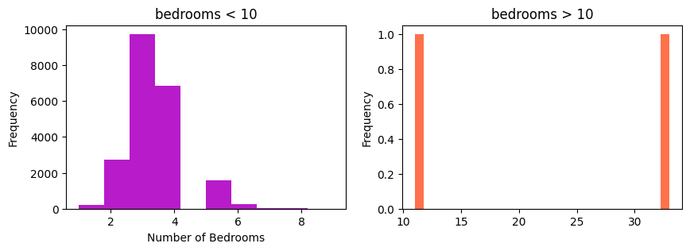
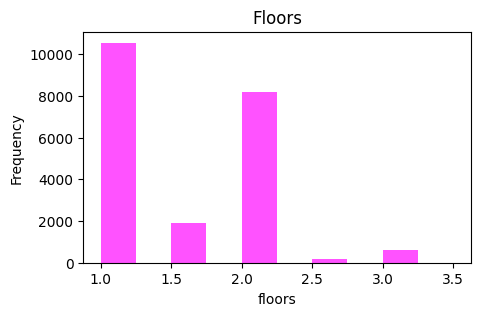
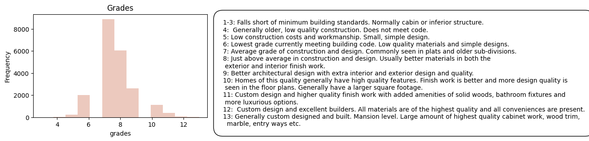
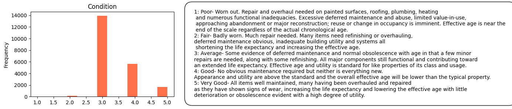

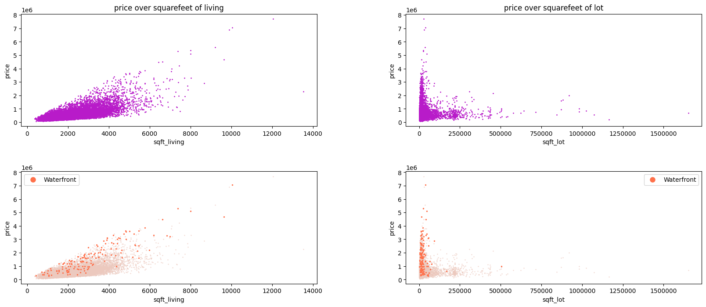

## Hypothesis

### 1 - House prices in the city center peak during the spring and summer months due to increased demand.

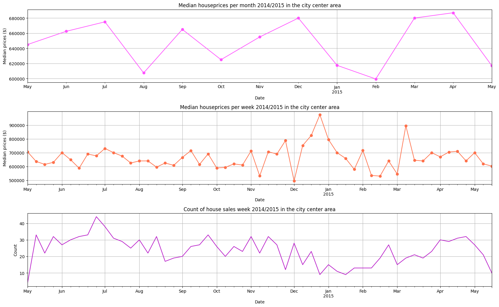
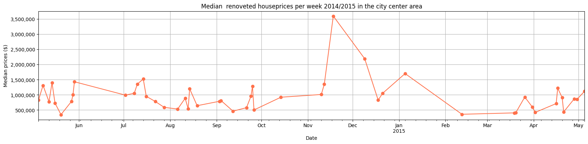

### 2 - During holiday seasons (like Thanksgiving or Christmas) Houses sell for lower prices because of reduced buyer activity.

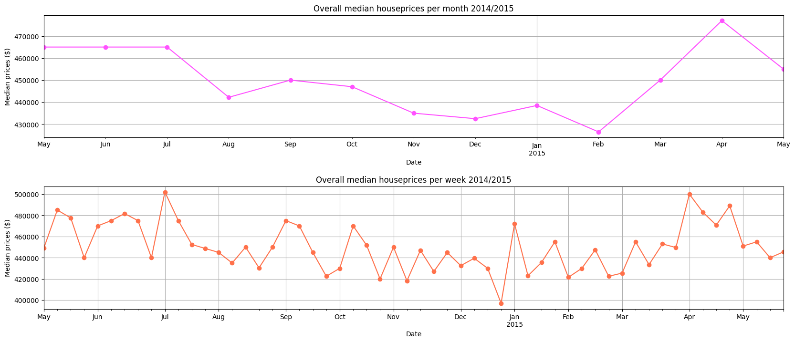

### 3 - Many houses are sold in March.

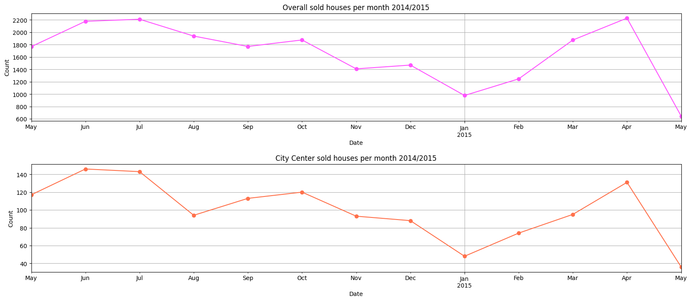

### 4 - Renovated houses sell for a significantly higher price compared to similar houses without renovation.

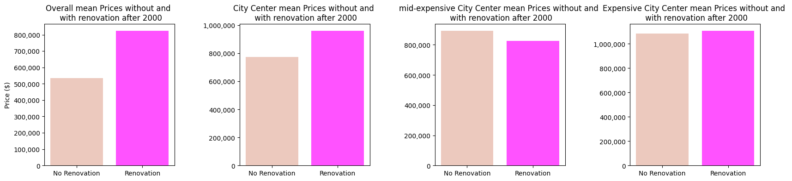
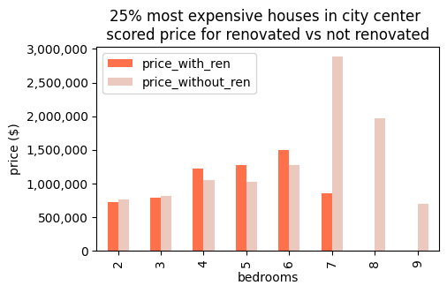
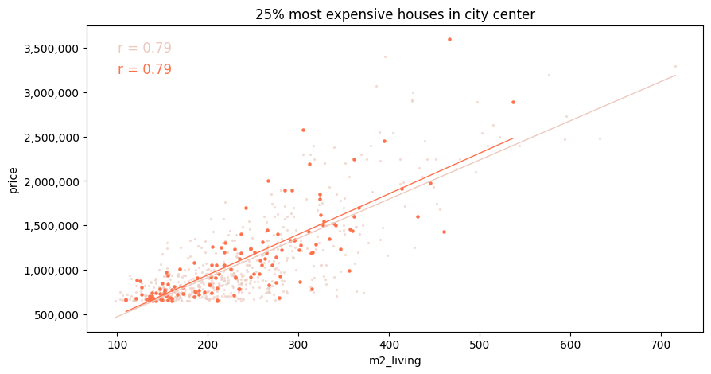
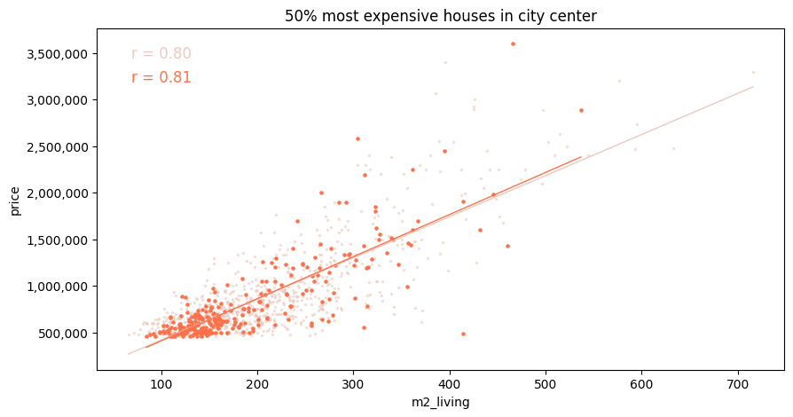
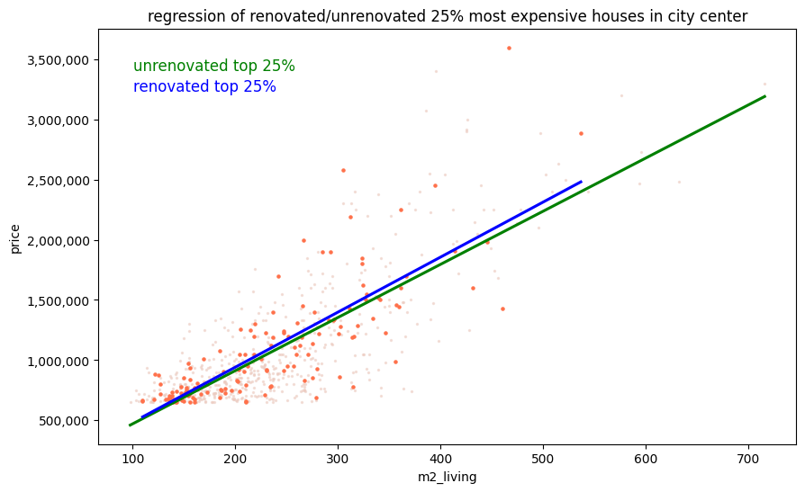
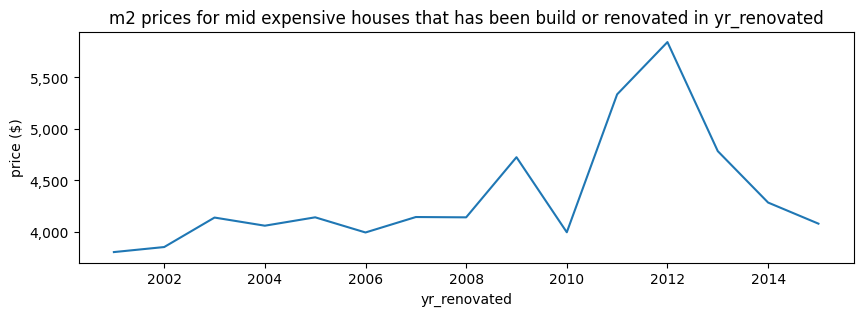
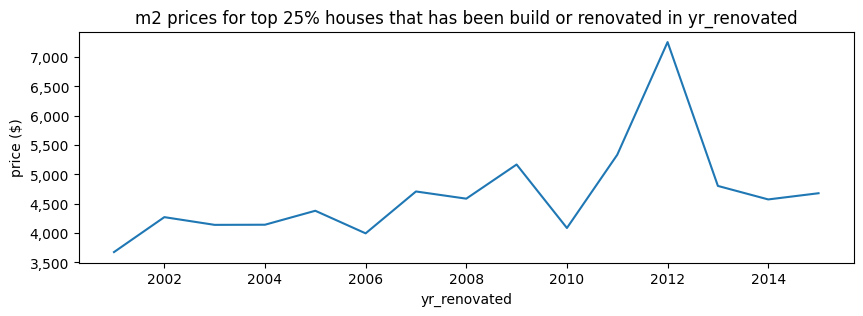

## graphical plots

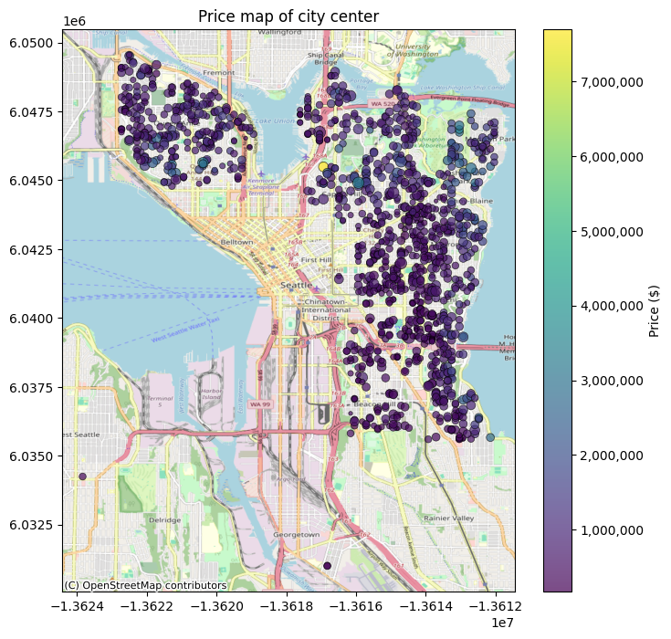
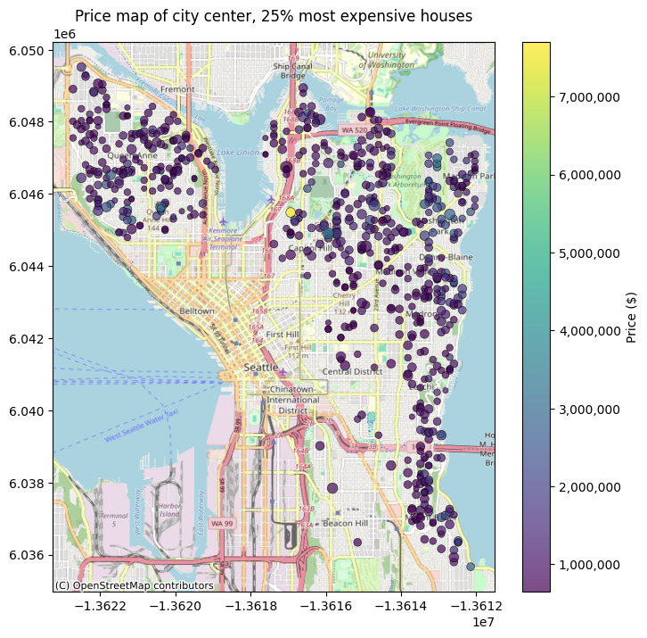

# recommendations for client

good month to sell are July, September, December, March and April for the city center

unti August many houses get sold
List them now if you want to sell fast

After renovation you can expect up to a 24% higher price
Depending on amount bedrooms and size and price expectations
for smaller appartments, renovation is not reccomended

If you want to renovate:
After August, prices migth drop , also less houses get sold
If you dont sell the houses to the desired price until August, start renovationimediately
